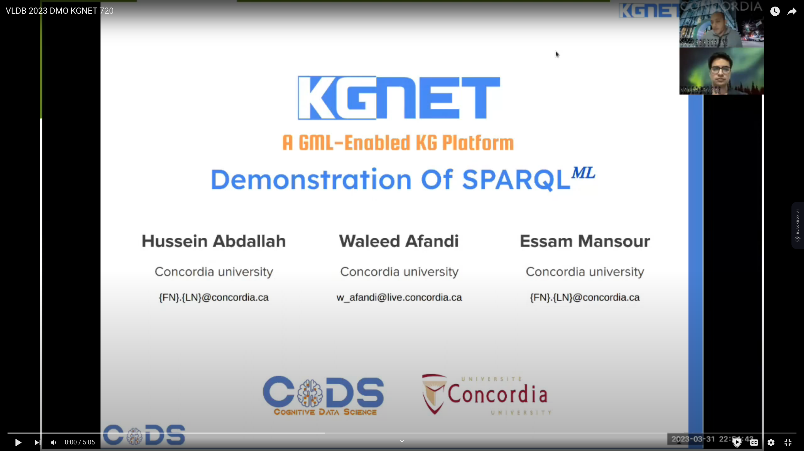

### <a href="https://arxiv.org/abs/2303.02166"> KGNET</a> Accepted at <a href="https://icde2023.ics.uci.edu/papers-special-track/">ICDE-2023</a>
# KGNET - A GML-Enabled RDF Engine
<p><b>Note: We are working on a full release of KGNET with all working functionalities by end of Augest</b></p>


<div style="text-align: justify">
<p>This vision paper proposes KGNet, an on-demand graph machine learning (GML) as a service on top of RDF engines to support GML-enabled SPARQL queries. KGNet automates the training of GML models on a KG by identifying a task-specific subgraph. This helps reduce the task-irrelevant KG structure and properties for better scalability and accuracy. While training a GML model on KG, KGNet collects metadata of trained models in the form of an RDF graph called KGMeta, which is interlinked with the relevant subgraphs in KG. Finally, all trained models are accessible via a SPARQL-like query. We call it a GML-enabled query and refer to it as SPARQLML. KGNet supports SPARQLML on top of existing RDF engines as an interface for querying and inferencing over KGs using GML models. The development of KGNet poses research opportunities in several areas, including meta-sampling for identifying task-specific subgraphs, GML pipeline automation with computational constraints, such as limited time and memory budget, and SPARQLML query optimization. KGNet supports different GML tasks, such as node classification, link prediction, and semantic entity matching. We evaluated KGNet using two real KGs of different application domains. Compared to training on the entire KG, KGNet significantly reduced training time and memory usage while maintaining comparable or improved accuracy. The KGNet source-code1 is available for further study</p></div>

## SPARQL-ML Demo Vedio
<a href="https://www.youtube.com/watch?v=DJaDhJ-OW-Q&ab_channel=hussienshahata" target="_blank"></a>
<br/>
<a href="https://colab.research.google.com/drive/1mBVNdAGYi7V6giMYCrYhz7oCvZpTvDyI?usp=sharing" target="_blank"> 
  
  <span style="vertical-align:top" >SAPRQL-ML Demo Colab notebook.</span> </a>

## Installation
* Clone the `kgnet` repo 
* Create `kgnet` Conda environment (Python 3.8) and install pip requirements.
* Activate the `kgnet` environment
```commandline
conda activate kgnet
```

## Quickstart
<ul>
<li>
<b>Install <a href="https://github.com/openlink/virtuoso-opensource">openlink Virtuoso Version 07.20.3229 </a> and load the knowledge graphs used in this paper. We use DBLP version <a href="https://dblp.org/rdf/release/">2022-06-01</a>, and <a href="https://data.deepai.org/FB15K.zip">FB15K</a>. </b>
</li>
<li>
<b> Prepaare endpoint URI for each graph to be used with kgnet. </b>
</li>
</ul>

<b>Generating the Meta-sampled graph dataset:</b>
1. under dataSampling the node sampler and edge sampler methods are used to sample large datasets for node classification and link prediction respectively. the sampling methods take the sull graph as input and the traget node or target edge and generate the task sampled subgraph
```python
# run node sampler 
python nodesampler.py --KG DBLP --targetNode https://dblp.org/rdf/schema-publishedIn
python edgesampler.py --KG FB15K --targetEdge /people/person/profession
```
2. Run data transformer [GML dataTransformer](/DataTransform/kgnet_data_transformer.py)
transform your dataset into adjaceny metrics for node classification task by providing 
   1. the triples (CSV/TSV) dataset 
   2. the splitting criterria i.e. https://dblp.org/rdf/schema#yearOfEvent
   3. the target nodes labels i.e. https://dblp.org/rdf/schema#publishedIn
The generated splits are
```
knoweldge graph dataset /
├── mapping
│   └── nodex_entid2name.csv
│   └── ....
├── raw
│   └── node-label
│   └── node-feat
│   └── relations
│      └── nodex_rel_nodey
│      └── ....
├── split
│   └── train
│   └── test
│   └── valid
...
```
```python
# run data transformer sampler 
python kgnet_data_transformer.py --KG DBLP --splittingEdge  https://dblp.org/rdf/schema-yearOfEvent --labelsEdge https://dblp.org/rdf/schema-publishedIn
```

3. Run your GML-Queries [GML Queries](/GMLOperators_old)
     - GML **Insert (Model Train)** Query
       ```python
       gml_query=""" prefix dblp:<https://www.dblp.org/>
       prefix kgnet:<https://www.kgnet.com/>
       Insert into <kgnet>  { ?s ?p ?o }
       where {select * from  kgnet.TrainGML(
       {modelName: 'MAG_Paper-Venue_Classifer',
        GML-Operator: kgnet:NodeClassifier,
        TargetNodes: dblp:publication,
        NodesLables: dblp:venue,
        aggregator: 'mean',
        activationFunction: 'sigmoid',
        hyperParameters:{ batchSize: 50,
                       n-layers:3,
                       h-dim:100 },
        budget:{ MaxMemory:50GB,
                MaxTime:1h,
                Priority:ModelScore} } )}""" 
   
        python InsertOperator.py --query gml_query
       ```
     - GML **Node Classifier** Query   
        ```python
        gml_query="""prefix dblp: <https://www.dblp.org/>
        prefix kgnet: <https://www.kgnet.com/>
        select ?title ?venue
        where { 
        ?paper a dblp:Publication.
        ?paper dblp:title ?title.
        ?paper ?NodeClassifier ?venue.
        ?NodeClassifier a kgnet:NodeClassifier.
        ?NodeClassifier kgnet:TargetNode dblp:paper.
        ?NodeClassifier kgnet:NodeLabel dblp:venue.}"""   
      
         python NodeClassifier.py --query gml_query
         ```
     - GML **Delete** Query   
        ```python
        gml_query="""prefix dblp:<https://www.dblp.org/>
        prefix kgnet:<https://www.kgnet.com/>
        delete {?NodeClassifier ?p ?o}
        where {
        ?NodeClassifier a kgnet:NodeClassifier.
        ?NodeClassifier kgnet:classifierTarget dblp:publication.
        ?NodeClassifier kgnet:classifierLabel dblp:venue.}"""
      
        python InsertOperator.py --query gml_query
        ```
     - GML **Link Predictor** Query   
        ```python
         gml_query="""prefix dblp: <https://www.dblp.com/>
         prefix kgnet: <https://www.kgnet.com/>
         select ?person ?affiliation
         where { ?person a fb:person.
         ?person ?LinkPredictor ?affiliation.
         ?LinkPredictor a kgnet:LinkPredictor.
         ?LinkPredictor kgnet:SourceNode dblp:person.
         ?LinkPredictor kgnet:DestinationNode dblp:affiliation.
         ?LinkPredictor kgnet:TopK-Links 10.}"""  
       
         python LinkPredictor.py --query gml_query
         ```
      
##  Using the Kgnet Web Interface 
Kgnet provides predefined operators in form of python apis that allow seamless integration with a conventional data science pipeline.
Checkout our [rep](https://github.com/hussien/KGNet-Interface) and [KGNET APIs](GMLWebServiceApis)

## kgnet APIs
See the full list of supported GML-Operators [here](docs/kgnet_gml_operators.md).

## Citing Our Work
If you find our work useful, please cite it in your research:
<br>
@INPROCEEDINGS{10184515,
  author={Abdallah, Hussein and Mansour, Essam},
  booktitle={2023 IEEE 39th International Conference on Data Engineering (ICDE)}, 
  title={Towards a GML-Enabled Knowledge Graph Platform}, 
  year={2023},
  volume={},
  number={},
  pages={2946-2954},
  doi={10.1109/ICDE55515.2023.00225}}

## Publicity
This repository is part of our submission to CIDR-2023. We will make it available to the public research community upon acceptance. 

## Questions
For any questions please contact us at:<br/> hussein.abdallah@concordia.ca , essam.mansour@concordia.ca  
