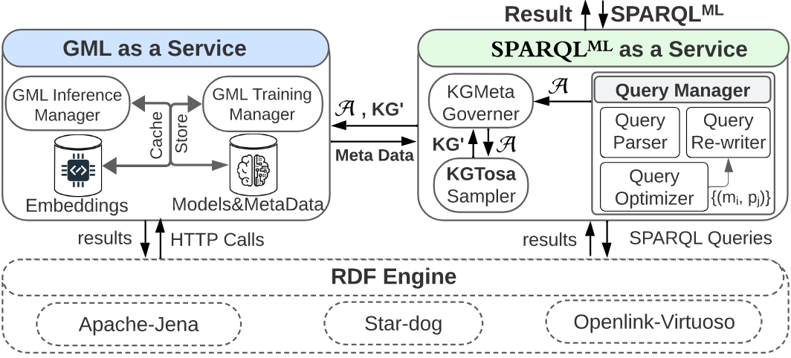

### <a href="https://arxiv.org/abs/2303.02166"> KGNET</a> Accepted at <a href="https://icde2023.ics.uci.edu/papers-special-track/">ICDE-2023</a>
# KGNET - A GML-Enabled RDF Engine
<p><b>Note: We are working on a full release of KGNET with all working functionalities by end of Augest</b></p>



<div style="text-align: justify">
<p>This vision paper proposes KGNet, an on-demand graph machine learning (GML) as a service on top of RDF engines to support GML-enabled SPARQL queries. KGNet automates the training of GML models on a KG by identifying a task-specific subgraph. This helps reduce the task-irrelevant KG structure and properties for better scalability and accuracy. While training a GML model on KG, KGNet collects metadata of trained models in the form of an RDF graph called KGMeta, which is interlinked with the relevant subgraphs in KG. Finally, all trained models are accessible via a SPARQL-like query. We call it a GML-enabled query and refer to it as SPARQLML. KGNet supports SPARQLML on top of existing RDF engines as an interface for querying and inferencing over KGs using GML models. The development of KGNet poses research opportunities in several areas, including meta-sampling for identifying task-specific subgraphs, GML pipeline automation with computational constraints, such as limited time and memory budget, and SPARQLML query optimization. KGNet supports different GML tasks, such as node classification, link prediction, and semantic entity matching. We evaluated KGNet using two real KGs of different application domains. Compared to training on the entire KG, KGNet significantly reduced training time and memory usage while maintaining comparable or improved accuracy. The KGNet source-code1 is available for further study</p></div>

## SPARQL-ML Demo Vedio
<a href="https://www.youtube.com/watch?v=DJaDhJ-OW-Q&ab_channel=hussienshahata" target="_blank"></a>
<br/>
<a href="https://colab.research.google.com/drive/1mBVNdAGYi7V6giMYCrYhz7oCvZpTvDyI?usp=sharing" target="_blank"> 
  
  <span style="vertical-align:top" >SAPRQL-ML Demo Colab notebook.</span> </a>

## Installation
* Clone the `kgnet` repo 
* Create `kgnet` Conda environment (Python 3.8) and install pip requirements.
* Activate the `kgnet` environment
```commandline
conda activate kgnet
```

## Quickstart
<ul>
<li>
<b>Install <a href="https://github.com/openlink/virtuoso-opensource">openlink Virtuoso Version 07.20.3229 </a> and load the knowledge graphs used in this paper. We use DBLP version <a href="https://dblp.org/rdf/release/">2022-06-01</a>, and <a href="https://data.deepai.org/FB15K.zip">FB15K</a>. </b>
</li>
<li>
<b> Prepaare endpoint URI for each graph to be used with kgnet. </b>
</li>
</ul>

## 1. Initializing KGNET 
### Step 1:  Importing KGNET and setting up path.
Use the following code to import KGNET and set up the path where you want to store your datasets:
```python
from KGNET.KGNET import KGNET
KGNET.KGNET_Config.datasets_output_path="/path/to/datasets/"
```
<u>Note: It is suggested that you observe the default paths inside KGNET/Constants.py and configure them based on your preference.</u>

### Step 2: Create a KGNET instance and load your Knowledge Graph (KG).
A KGNET object contains all the necessary details about the KG. You can instantiate a KGNET object with the following example:
```python
kgnet=KGNET(KG_endpointUrl='http://206.12.98.118:8890/sparql',KG_NamedGraph_IRI='https://dblp2022.org',KG_Prefix='dblp2022')
```
<u>Note: The arguments provided above are for the demo scenario. You can replace them with your own KG.</u>


## 2. Performing Node Classification on your KG
### Step 1: Train a Node Classification (NC) model.
To train a NC model for your KG, you can call the ```train_GML``` function of the KGNET. It requires 4 required arguments.

```operatorType``` = Operation type; Node Classification or Link Prediction.

```GNNMethod``` = Method for the model,e.g. GraphSaint, RGCN,etc.

```targetNodeType``` = Select the target node from your KG.

```labelNodeType``` = the label node you want to predict.

Below is an example for training a model on DBLP dataset

```python
kgnet.train_GML(operatorType=KGNET.GML_Operator_Types.NodeClassification,
                GNNMethod=KGNET.GNN_Methods.Graph_SAINT,
                targetNodeType="dblp2022:Publication",labelNodeType="dblp2022:publishedIn_Obj")
```
<u> Note: Once your Model is trained, it is uploaded to the KGNET.</u>

### Step 2: Perform NC Inference on your KG.
Once you have trained your model, you can use it to perform inference on your KG. For this purpose you can write a SPARQL query as shown in the example below:
```python
query = """
            prefix dblp2022:<https://dblp.org/rdf/schema#>
            prefix kgnet:<http://kgnet/>
            select ?Publication ?Title ?dblp_Venue ?Pred_Venue
            from <https://dblp2022.org>
            where
            {
            ?Publication a dblp2022:Publication .
            ?Publication  dblp2022:publishedIn ?dblp_Venue .
            ?Publication  dblp2022:title ?Title .
            ?Publication ?NodeClassifier ?Pred_Venue .
            ?NodeClassifier a <kgnet:types/NodeClassifier>.
            ?NodeClassifier <kgnet:targetNode> dblp2022:Publication.
            ?NodeClassifier <kgnet:labelNode> dblp2022:publishedIn_Obj.
            }
            limit 100
        """

```
Once you have the query, you can execute it with the following function:

```python
kgnet.executeSPARQLMLInferenceQuery(query)
```
This function runs the inference pipeline and returns the predictions along with stats associated with the inference.

## 2. Performing Link Prediction on your KG
The process of performing Link Prediction on your KG is almost identical to that of NC. 
### Step 1: Train a Link Prediction (LP) model.

To train a NC model for your KG, you can call the ```train_GML``` function of the KGNET. It requires 3 required argument:

```python
kgnet.train_GML(operatorType=KGNET.GML_Operator_Types.LinkPrediction,
                 targetEdge=TargetEdge,
                 GNNMethod=KGNET.GNN_Methods.MorsE)
```

```operatorType``` = Operation type; Node Classification or Link Prediction
```GNNMethod``` = Method for the model,e.g. GraphSaint, RGCN,etc.
```targetEdge``` = Select the target edge you want to predict on your KG.

###  Step 2: Perform LP Inference on your KG.
Much like NC, you can write a query to perform inference on your choice of nodes as shown in the example below.

```python
query = """         prefix dblp2022:<https://dblp.org/rdf/schema#>
                    prefix kgnet:<https://kgnet/>
                    select ?publication ?Title ?pred_author
                    from <https://dblp2022.org>
                    where {
                    ?publication a dblp2022:Publication.
                    ?publication dblp2022:title ?Title .
                    ?publication dblp2022:authoredBy ?auth .
                    ?publication ?LinkPredictor ?pred_author .
                    ?LinkPredictor  a <kgnet:types/LinkPredictor>.
                    ?LinkPredictor  <kgnet:targetEdge>  """+ "\""+TargetEdge+"\""+ """ .
                    ?LinkPredictor <kgnet:GNNMethod> "MorsE" .
                    ?LinkPredictor <kgnet:topK> 4.
                    }
                    order by ?publication
                    limit 300
            """

```
Once you have the query, you can run the ```executeSPARQLMLInferenceQuery``` command to perform the inference:
```python
kgnet.executeSPARQLMLInferenceQuery(query)
```

## 3. Exploring KGMETA:
As KGMETA contains a variety of Tasks and each may be associated with multiple GNN models you can query the KGMETA. For a given taskId you can view the models trained on it using the following function:

```python
kgnet.KGMeta_Governer.getGMLTaskModelsBasicInfoByID(taskId)
```

<!--
##  Using the Kgnet Web Interface 
Kgnet provides predefined operators in form of python apis that allow seamless integration with a conventional data science pipeline.
Checkout our [rep](https://github.com/hussien/KGNet-Interface) and [KGNET APIs](GMLWebServiceApis)

## kgnet APIs
See the full list of supported GML-Operators [here](docs/kgnet_gml_operators.md).
-->


## Citing Our Work
If you find our work useful, please cite it in your research:
<br>
@INPROCEEDINGS{10184515,
  author={Abdallah, Hussein and Mansour, Essam},
  booktitle={2023 IEEE 39th International Conference on Data Engineering (ICDE)}, 
  title={Towards a GML-Enabled Knowledge Graph Platform}, 
  year={2023},
  volume={},
  number={},
  pages={2946-2954},
  doi={10.1109/ICDE55515.2023.00225}}

## Publicity
This repository is part of our submission to CIDR-2023. We will make it available to the public research community upon acceptance. 

## Questions
For any questions please contact us at:<br/> hussein.abdallah@concordia.ca , waleed.afandi@concordia.ca essam.mansour@concordia.ca  
